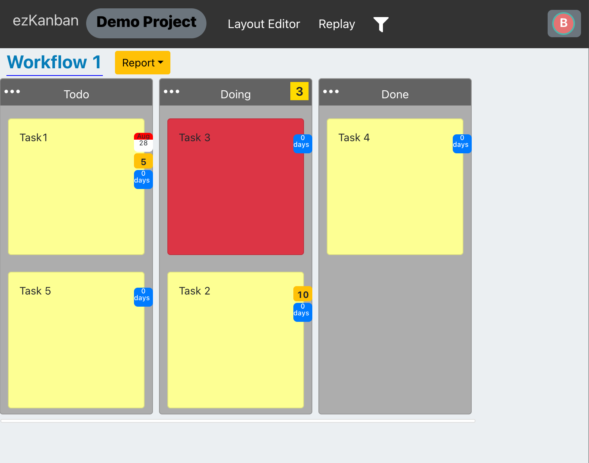

## 專案介紹

參與實驗室國科會計畫，與其他實驗室成員共同開發線上多人看板系統 ezKanban，主要參與計畫第三年的開發。

核心架構包含 DDD、Clean Architecture、CQRS 與 Event Sourcing。

## 主要參與內容

- Scrum 業務邏輯實作：在 DDD 與 Clean Architecture 的規範下開發 Scrum 模組，實作 Product Backlog Item（PBI）狀態流轉與 Task 同步機制，並透過 Reactor 模式處理非同步邏輯，確保 Aggregate 間的資料一致性。
- CQRS 與微服務通訊架構重構：明確劃分內部與外部領域事件，抽離 Avro 事件類別與 Notifier 的高度相依，並實作 Strong/Weak Schema 訊息控制器。
- 非同步測試隔離與穩定度優化：以 UUID 隔離 Kafka Topic 與 Consumer Group，為外部訊息測試實作 Template Method，並完善各 Handler 的冪等性檢驗。
- 系統現代化與基礎設施維護：將系統核心升級至 Spring Boot 3 與 Jakarta EE，分離測試與生產環境的 Kafka 設定，並維護 Docker Compose 及 Kubernetes 部署設定。

## 系統畫面

## 研究計畫

- 計畫名稱：在微服務架構中套用命令查詢責任分離模式對於簡化領域模型、維持架構整潔與提升讀取效能之研究
- 執行起迄：2023/08/01 - 2026/07/31
- 計畫編號：112-2221-E-027-050-MY3
