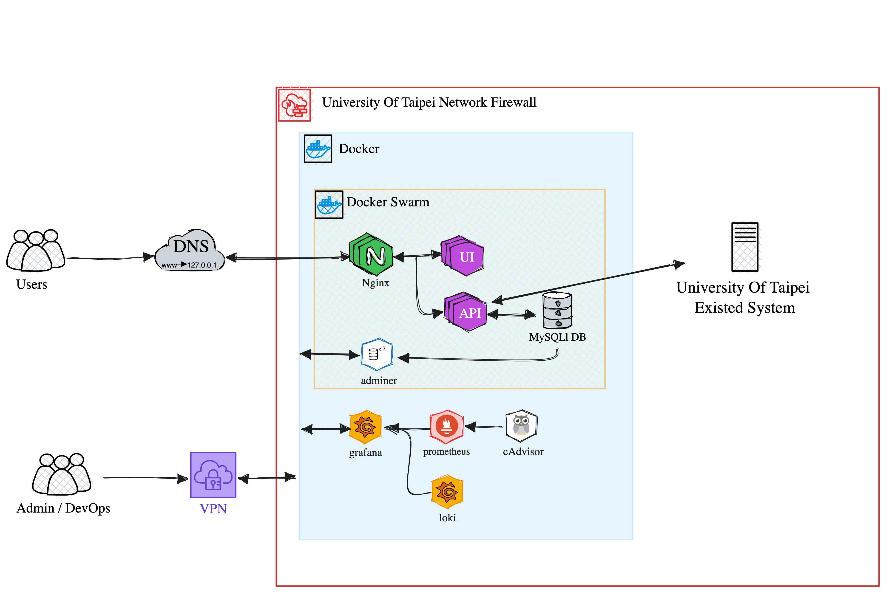
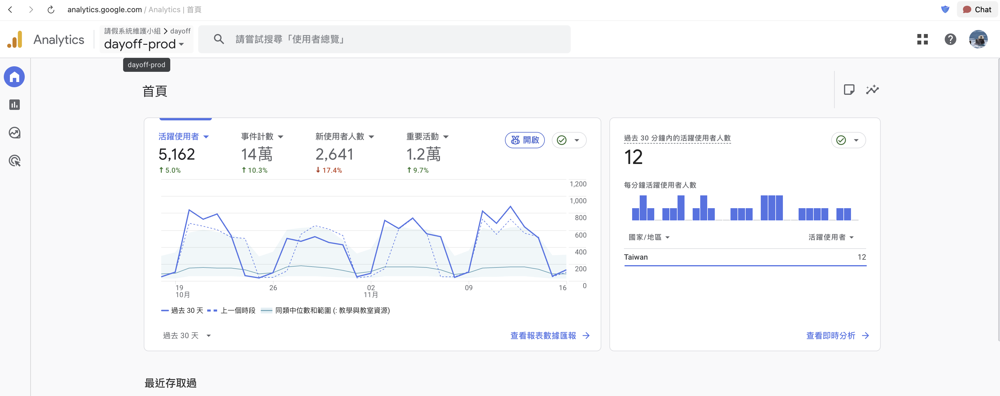
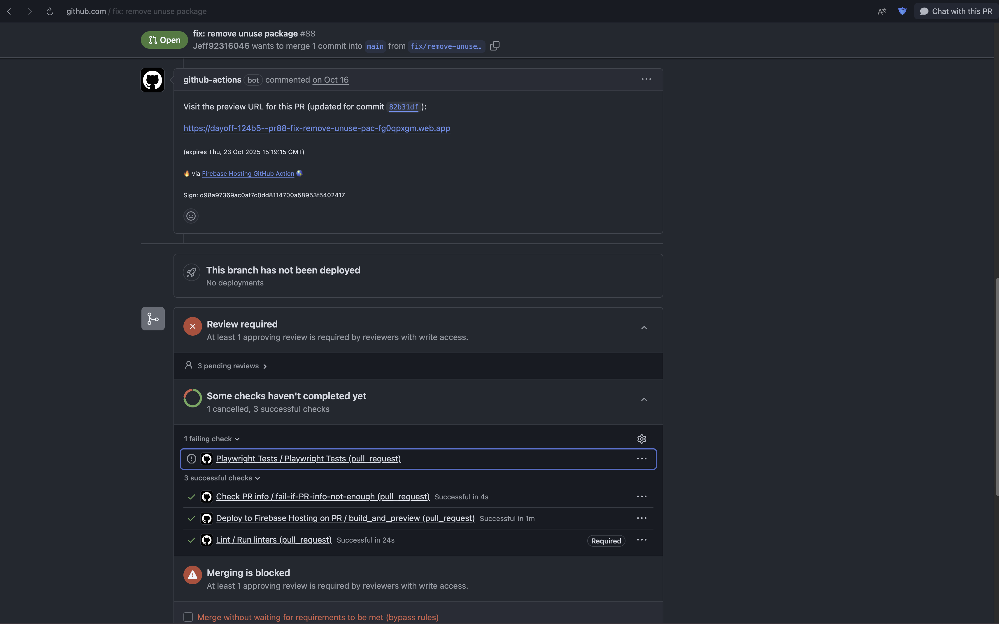
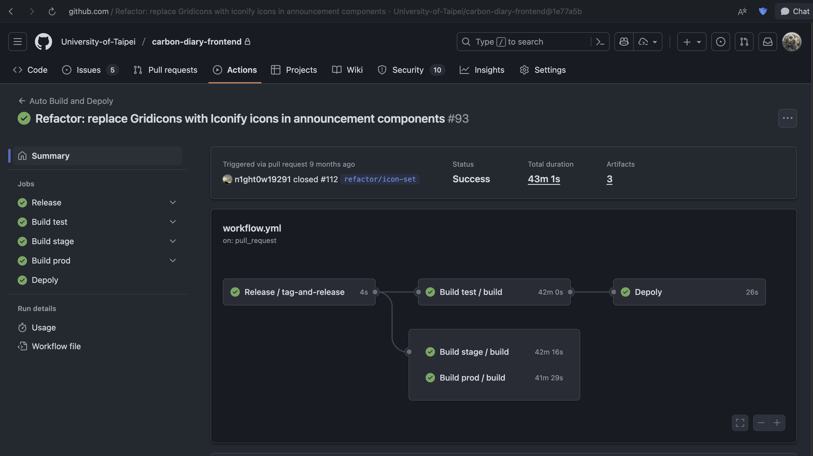

## 專案介紹

參與臺北市立大學計算機與網路中心發起的校務系統協作計畫，在團隊中擔任 Backend／DevOps Developer，負責學生請假系統的後端 API、自動化部署與上線後維運。

## 主要負責內容

- 使用 FastAPI 開發後端 API，並串接校內既有系統。
- 管理 Development、Stage 與 Production 三套環境。
- 撰寫 GitHub Actions workflow，涵蓋 Pull Request 規則檢查、測試、Docker image build 與部署。
- 使用 Locust 對 API 進行壓力測試。
- 協助前端除錯、處理使用者回饋、修正錯誤並排查正式環境問題。
- 為計算機與網路中心人員進行系統維護教育訓練，並培訓維護小組的新成員。

## 系統架構與維運

系統部署在校內網路環境，以 Nginx 作為服務入口，前端、後端 API 與 MySQL 資料庫皆以容器執行，並透過 Docker Swarm 管理服務。監控與日誌系統整合 Grafana、Prometheus、cAdvisor 與 Loki，協助維運人員觀察服務狀態與排查問題。

## 系統使用情況

系統上線後持續提供校內學生使用，並透過 Google Analytics 觀察活躍使用者、事件數量與服務使用情況。

## CI/CD 與協作流程

Pull Request 會執行 lint、測試與規則檢查，並建立可供團隊檢視的預覽環境，讓問題能在合併前被發現。

校務系統協作計畫也將 release、測試、Stage／Production build 與部署流程整合至 GitHub Actions，降低手動操作造成的風險。

