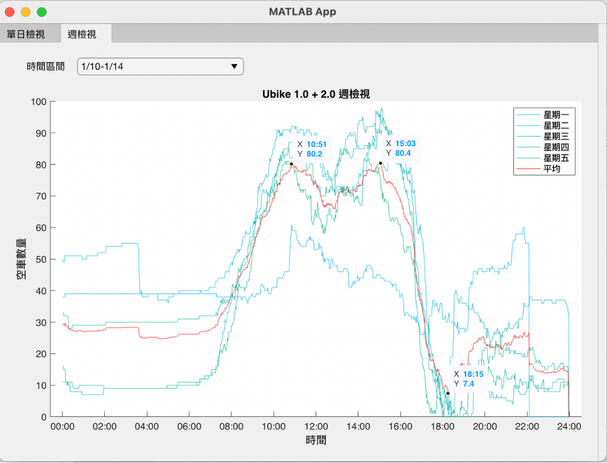

## 專案介紹

由於校門口的 YouBike 經常被借用完，為了找出校園 YouBike 的熱門時段，因此製作此資料收集與分析工具。

## 功能

- 每分鐘透過 YouBike API 取得校門口剩餘腳踏車數量。
- 將收集到的資料儲存成 CSV 檔案。
- 以 MATLAB 讀取資料，按週製作曲線圖。
- 自動標出腳踏車數量最多與最少的時間。

## 分析畫面

MATLAB App 會將一週內各時段的可借車輛數繪製成曲線，並標示平均值、最高值與最低值，方便比較不同日期的使用情況。

