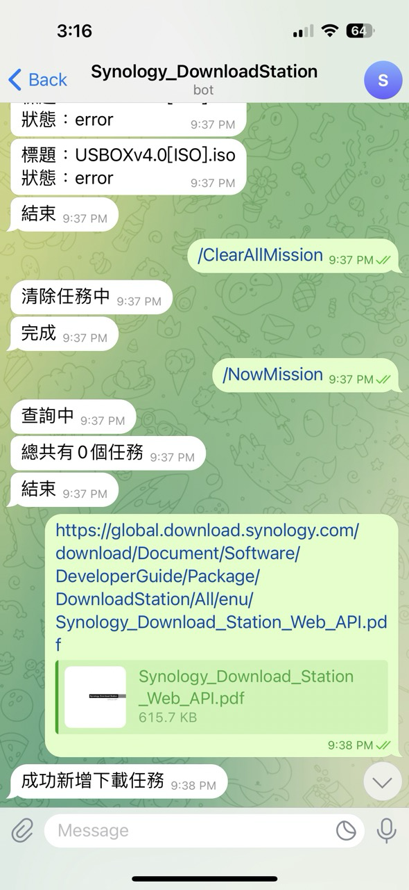
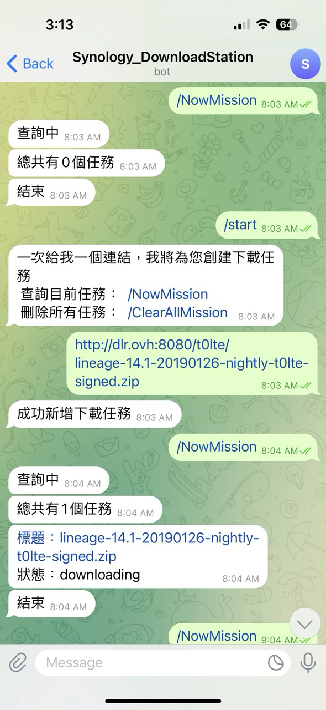

## 專案介紹

一個可以透過 Telegram 在 Synology NAS 的 Download Station 新增下載任務的聊天機器人。

## 功能

- 新增 Download Station 下載任務。
- 檢視目前下載任務的狀態。
- 任務完成後，透過文字訊息刪除已完成的下載任務。

## 操作畫面

### 新增下載任務

將下載網址傳送給聊天機器人後，機器人會把任務加入 Synology Download Station，並回覆新增結果。

### 查詢任務狀態

透過指令可以查看機器人提供的功能，以及目前下載任務的進度與狀態。

